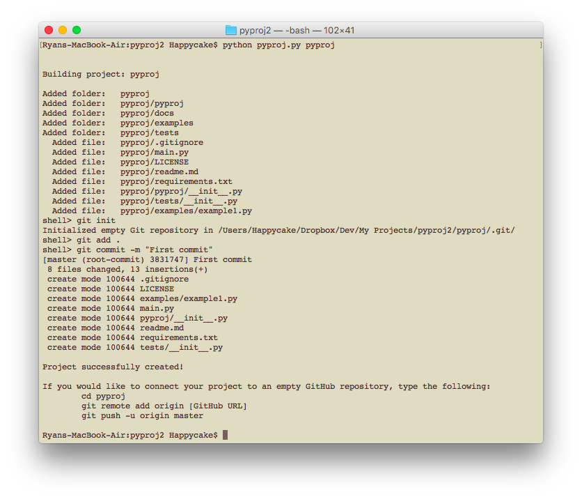

# PyProj

PyProj is a simple utility for initializing a skeleton Python project suitable for upload to GitHub.  It will also set up a `git` repository for you.

A key feature here is that the script will clean up anything it has written and quit if it thinks it's trying to overwrite existing files.  The module `savely` (SAVE safeLY) keeps track of this.

This project directory was created using PyProj! :)

## Usage
Simply navigate to the location where you would like your project folder to appear, and type:

    python pyproj.py [project_name]

## Result

Here's what the results look like...

...with files initialized with some simple data where appropriate.
